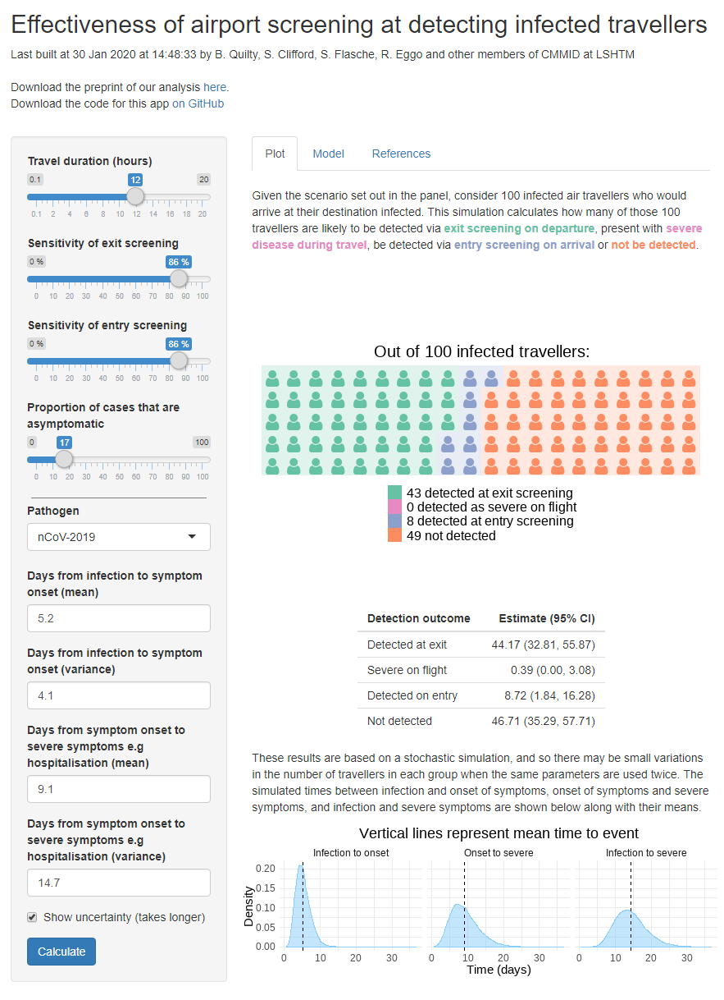

# airport_screening

Effectiveness of airport screening at detecting infected travellers

| Authors |
| :-- |
| Mr. Billy Quilty |
| Assoc. Prof. Stefan Flasche |
| Dr. Sam Clifford |
| Assoc. Prof. Rosalind Eggo |
| Other members of CMMID at LSHTM |

https://cmmid-lshtm.shinyapps.io/traveller_screening/

This repository contains the code for a Shiny app whose purpose is to display the effectiveness of screening arrivals for infectious diseases. We assume that the infection may have a latent stage during which travellers are infected but not symptomatic. They may become symptomatic during their flight, which may be detected by entry screening, or after their arrival, and therefore no screening would have detected an infection.

Users may adjust the following parameters:

* duration of flight
* mean and variance of the probability distribution describing time between infection and onset of symptoms
* mean and variance of the probability distribution describing time between onset of symptoms and recovery from infection
* sensitivity of exit screening
* sensitivity of entry screening
